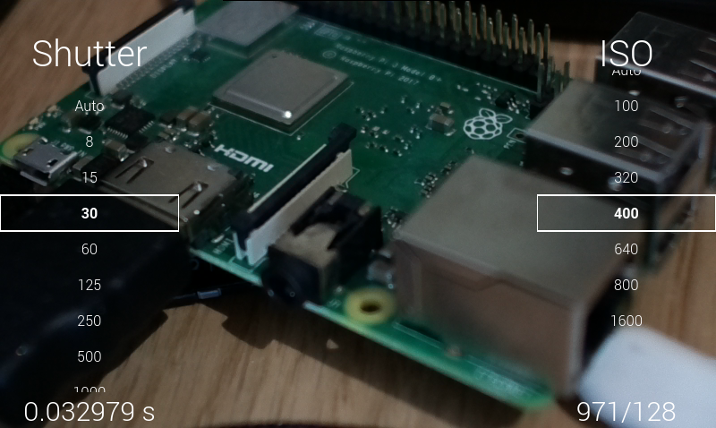
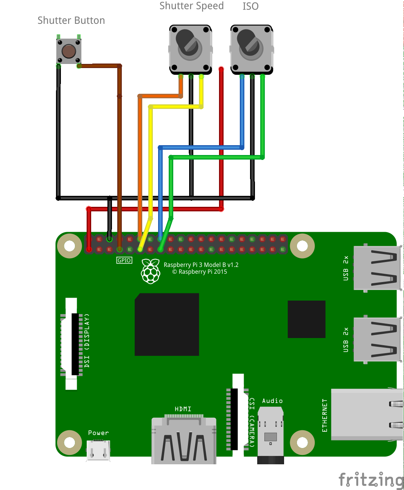

# Raspberry Pi Camera

Let's build a digital camera out of a Raspberry Pi, the HQ Camera Module, and a touch screen.

The camera's settings are fully customizable:

- Shutter Speed with a touchscreen menu or hardware encoder
- ISO with a touchscreen menu or hardware encoder
- Shutter by tapping the touchscreen center or hardware button
- Aperture on the lens ring
- Focus Distance on the lens ring
- Focal Length by changing lenses

## Prerequisites

Most tutorial projects I have found on the internet use OpenCV or PyGame to draw their UI. I have found these libraries to be a pain to work with, however, and use Qt for Python (aka pyside2) instead.

You will need to install:

    apt install python3-pyside2.qt
    pip3 install picamera[array]

Additionally, you will need to run `raspi-config`, go to *Advanced Options* and *Memory Split*, and adjust it to 256 Mb, otherwise the camera won't be able to take full-resolution pictures.

In terms of hardware, I use the Raspberry Pi HQ Camera, A Raspberry Pi 4, a push button, two rotary encoders, and a Waveshare 4.3" 800x480 IPS HDMI capacitive touch screen display. If you buy a different display, make sure it is connected via HDMI (we need the GPIOs and GPIO-connected displays refresh too slowly), and has a capacitive touch sensor (resistive touch is bad for slider controls).

## Hardware Setup

Here is a crude drawing of the button and encoder set up:

(My encoders have a fourth +3.3V pin. I added this as an additional red wire in the schematic.)

## TODO

- Power Supply
- Case
- Image Processing

## License

This project is licensed under the terms of the GPL v3 license.
